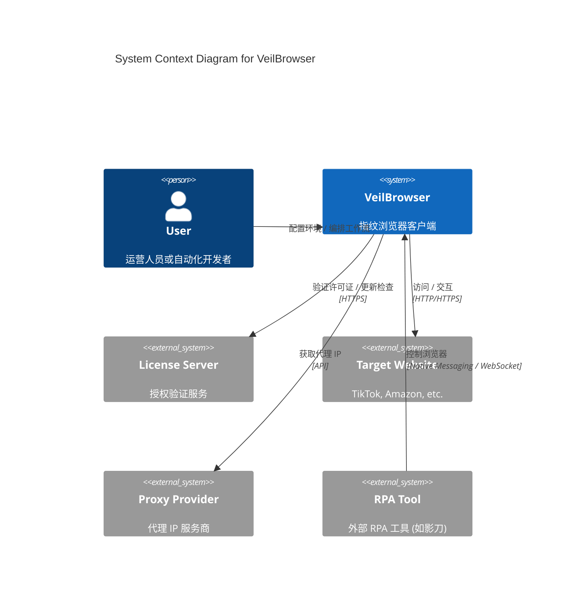

# C4 架构模型 (C4 Architecture Model)

本目录包含 VeilBrowser 系统的 C4 架构视图。

## System Context (Level 1)

展示 VeilBrowser 与外部系统的交互关系。



## Container Diagram (Level 2)

展示 VeilBrowser 内部的高层容器结构。

```mermaid
C4Container
    title Container Diagram for VeilBrowser

    Person(user, "User", "用户")

    System_Boundary(c1, "VeilBrowser Desktop App") {
        Container(main_process, "Main Process", "Electron/Node.js", "负责应用生命周期、IPC通信、数据持久化、代理管理")
        Container(renderer, "Renderer UI", "React/Vite", "用户界面：Profile管理、工作流编辑器")
        ContainerDb(sqlite, "Local Database", "SQLite", "存储 Profile 配置、工作流数据、Cookie")
        Container(browser_worker, "Browser Worker", "Electron Child Process", "独立的浏览器控制进程，负责具体 Profile 的运行与指纹注入")
    }

    Rel(user, renderer, "交互")
    Rel(renderer, main_process, "发送指令 (IPC)", "Electron IPC")
    Rel(main_process, sqlite, "读写数据", "Better-SQLite3")
    Rel(main_process, browser_worker, "启动/监控", "Node.js spawn / Stdio")
    Rel(browser_worker, target_site, "访问网络", "Chromium Network")
```

> **注意**: 更详细的组件图 (Component Diagram) 请参考 [05-layers/](../05-layers/) 下各层的详细设计文档。
