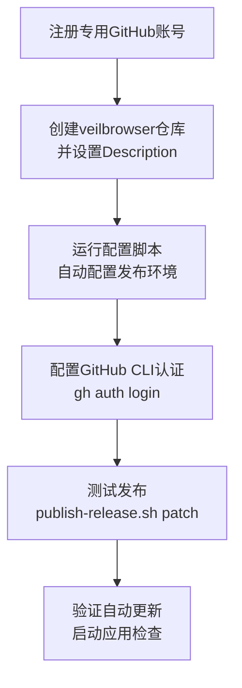

# 🐙 GitHub Release 配置状态

## ✅ 已完成的配置

### 1. 自动更新服务
- ✅ **UpdateService** 已完整实现 (`src/main/services/update/update.service.ts`)
- ✅ **IPC处理器** 已设置 (`src/main/ipc/handlers/update/index.ts`)
- ✅ **主进程初始化** 已完成 (`src/main/core/main.ts`)
- ✅ **electron-updater** 依赖已安装

### 2. 构建配置
- ✅ **electron-builder** 配置已优化 (`electron-builder.config.ts`)
- ✅ **跨平台构建** 已支持 (macOS/Windows/Linux)
- ✅ **npmRebuild: false** 已配置 (解决原生模块问题)

### 3. 配置文档和脚本
- ✅ **详细配置指南** (`docs/github-release-setup.md`)
- ✅ **自动化设置脚本** (`scripts/setup-github-release.sh`)
- ✅ **发布脚本** (`scripts/publish-release.sh`)

## 🚀 待用户完成的步骤

### 1. 注册专用GitHub账号
```bash
# 建议用户名: veilbrowser-app, veilbrowser-official, vb-browser 等
# 使用专用邮箱，避免关联个人身份
# 开启两步验证
```

### 2. 创建GitHub仓库
- 仓库名: `veilbrowser`
- 设置为 **公开仓库** (Public)
- **Description**: 复制项目根目录的 GitHub Description
- 不需要初始化README等文件

### 3. 运行配置脚本
```bash
# 自动配置所有设置（替换为您的实际用户名）
./scripts/setup-github-release.sh veilbrowser-app veilbrowser

# 脚本会自动：
# - 更新 electron-builder.config.ts
# - 创建发布脚本 (使用临时Git配置)
# - 创建环境变量模板
```

### 4. 配置GitHub CLI（推荐）
```bash
# 安装GitHub CLI（如果没有）
brew install gh  # macOS

# 登录到专用账户
gh auth login
# 选择：GitHub.com → HTTPS → 登录浏览器完成认证
```

### 5. 首次发布测试
```bash
# 构建并发布测试版本
./scripts/publish-release.sh patch

# 脚本会自动使用专用Git账户，不影响您的全局配置
```

## 🔧 Git 配置说明

**重要提醒：**
- 🚨 **无需配置全局 Git 账户**：发布脚本会自动使用专用账户
- 🔧 **本地仓库配置**：脚本使用 `git config --local` 只影响当前仓库
- 👤 **账户隔离**：您的个人 Git 配置完全不受影响

**脚本自动配置的内容：**
```bash
# 脚本会自动设置（仅在veilbrowser仓库中生效）
git config --local user.name "veilbrowser-app"
git config --local user.email "veilbrowser.app@gmail.com"
```

## 📋 完整流程



## 🔍 验证方法

### 自动更新测试
1. 启动应用
2. 打开开发者工具 (View → Toggle Developer Tools)
3. 查看控制台日志，应该有:
   ```
   [UpdateService] 初始化完成
   [UpdateService] 开始检查更新
   ```

### 手动触发更新
```javascript
// 在开发者工具控制台执行
window.electron?.update?.checkForUpdates()
```

## 🔍 故障排除

### Git 配置验证
```bash
# 检查本地仓库配置（发布时使用）
cd /path/to/veilbrowser
git config --local user.name   # 应该显示 veilbrowser-app
git config --local user.email  # 应该显示 veilbrowser.app@gmail.com

# 检查全局配置（应该不变）
git config --global user.name  # 您的个人账户
git config --global user.email # 您的个人邮箱
```

### 发布失败排查
- **"Permission denied"**: 检查 GitHub CLI 是否正确登录 `gh auth status`
- **"Repository not found"**: 确认仓库名和用户名正确
- **Git 提交失败**: 检查是否有未暂存的文件 `git status`
- **构建失败**: 确保所有依赖已安装 `npm install`

### 重置配置
```bash
# 如需重置本地Git配置
cd /path/to/veilbrowser
git config --local --unset user.name
git config --local --unset user.email
```

## 📚 相关文档

- 📖 **配置指南**: `docs/github-release-setup.md`
- 🔧 **设置脚本**: `scripts/setup-github-release.sh`
- 🚀 **发布脚本**: `scripts/publish-release.sh`

## 🎯 状态总结

**✅ 代码层面**: 100% 完成
**✅ 配置层面**: 100% 完成
**⏳ 用户操作**: 等待GitHub账号注册

---

**🎉 一切准备就绪，只等你注册GitHub账号！**</contents>
</xai:function_call"> 

<xai:function_call name="run_terminal_cmd">
<parameter name="command">ls -la scripts/setup-github-release.sh
