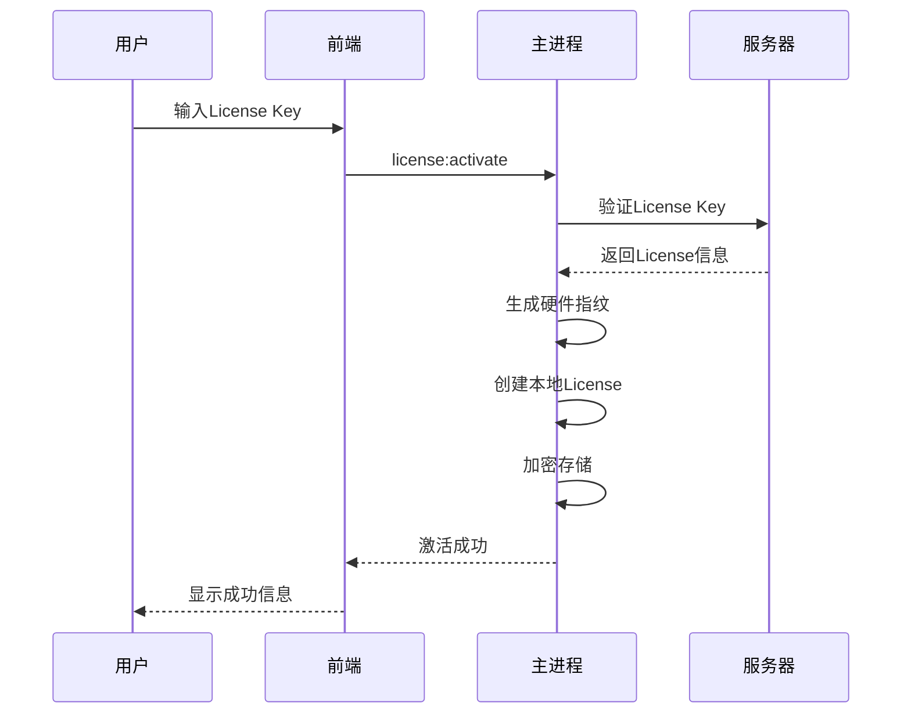

# VeilBrowser 授权管理系统设计文档

## 📋 概述

本文档详细描述 VeilBrowser 单机版授权管理系统的完整技术方案，采用"首次在线激活 → 本地加密License → 完全离线运行"的策略。

## 🎯 核心设计原则

### 隐私友好原则
- **最小化数据收集**: 只在激活时收集必要硬件信息
- **用户控制权**: 用户可选择是否开启心跳和统计
- **本地优先**: License完全存储在本地，无需持续联网

### 轻量验证原则
- **离线验证**: 激活后完全离线运行
- **温和检测**: 警告而非阻断正常使用
- **性能友好**: 启动时快速验证，无性能影响

### 防盗版原则
- **硬件绑定**: MAC + CPU ID + 主板ID 绑定
- **加密存储**: License本地加密存储
- **完整性校验**: 防止License文件篡改

## 🏗️ 系统架构

### 整体架构图

```
┌─────────────────────────────────────────────────────────────┐
│                    用户界面层 (React)                        │
│  ┌─────────────────────────────────────────────────────────┐ │
│  │  License激活页面 │ 功能限制提示 │ 隐私设置对话框         │ │
│  └─────────────────────────────────────────────────────────┘ │
└─────────────────────────────────────────────────────────────┘
                                │ IPC
┌─────────────────────────────────────────────────────────────┐
│                    主进程层 (Electron Main)                  │
│  ┌─────────────────────────────────────────────────────────┐ │
│  │ LicenseManager │ HardwareFingerprint │ LicenseValidator │ │
│  │ LicenseStorage │ AntiPiracyService  │ PrivacyManager    │ │
│  └─────────────────────────────────────────────────────────┘ │
│  ┌─────────────────────────────────────────────────────────┐ │
│  │ 本地数据库 (SQLite) │ 加密存储 (AES-256-GCM)             │ │
│  └─────────────────────────────────────────────────────────┘ │
└─────────────────────────────────────────────────────────────┘
                                │
                ┌───────────────┼───────────────┐
                │               │               │
        ┌───────▼───────┐ ┌─────▼─────┐ ┌──────▼──────┐
        │   激活服务器   │ │   心跳服务器 │ │   更新服务器  │
        │ (必需)         │ │ (可选)       │ │ (可选)        │
        └───────────────┘ └─────────────┘ └──────────────┘
```

## 📁 系统架构与目录结构

### 目录结构

```
src/
├── shared/
│   └── types/
│       └── licensing.ts                    # 许可证类型定义
│
├── main/
│   ├── services/
│   │   └── licensing/
│   │       ├── license.service.ts             # 🔄 核心许可证服务 (唯一服务)
│   │       ├── hardware.ts                    # 硬件指纹工具类
│   │       ├── crypto.ts                      # 加密工具类
│   │       ├── storage.ts                     # 存储工具类
│   │       ├── security.ts                    # 安全检测工具类
│   │       └── index.ts                       # 导出
│   │
│   ├── ipc/
│   │   └── handlers/
│   │       └── licensing.handler.ts           # IPC处理器
│   │
│   └── database/
│       └── migrations/
│           └── 202501XX_add_licensing_tables.ts
│
├── renderer/
│   ├── components/
│   │   └── licensing/
│   │       ├── LicenseActivationModal.tsx     # 激活弹窗
│   │       ├── LicenseStatusCard.tsx          # 许可证状态卡片
│   │       ├── FeatureLimitModal.tsx          # 功能限制提示
│   │       └── index.ts                       # 组件导出
│   │
│   ├── pages/
│   │   └── settings/
│   │       └── LicenseSettingsPage.tsx        # 许可证设置页面
│   │
│   └── hooks/
│       └── useLicense.ts                      # 许可证状态Hook
│
└── server/                                    # 🚀 服务端代码 (与src平级)
    ├── api/
    │   ├── license.ts                         # 许可证API路由
    │   └── index.ts
    │
    ├── services/
    │   └── license.service.ts                 # 许可证业务逻辑
    │
    ├── models/
    │   └── license.model.ts                   # 数据模型
    │
    ├── repositories/
    │   └── license.repository.ts              # 数据访问
    │
    ├── middleware/
    │   ├── auth.ts
    │   └── validation.ts
    │
    ├── utils/
    │   ├── crypto.ts
    │   └── logger.ts
    │
    ├── database/
    │   └── migrations/
    │       └── 202501XX_create_licensing_tables.ts
    │
    ├── config/
    │   ├── database.ts
    │   └── index.ts
    │
    ├── app.ts
    └── index.ts
```

### 架构说明

#### 客户端 (Electron主进程)
- **LicenseService**: 唯一的核心服务，负责所有许可证相关业务逻辑
- **工具类**: hardware.ts, crypto.ts, storage.ts, security.ts - 辅助功能实现
- **IPC处理器**: 处理渲染进程的许可证相关请求

#### 服务端 (Node.js API)
- **MVC架构**: 路由 → 服务 → 模型 → 仓库
- **独立部署**: 与Electron应用分离，便于维护和扩展
- **API设计**: RESTful风格，支持许可证激活、验证等功能

## 📊 许可证分级

### 许可证计划配置

```typescript
export const LICENSE_PLANS = {
  free: {
    name: 'Free',
    profileCount: 5,
    monthlyPrice: 0,
    yearlyPrice: 0,
    features: {
      maxProfiles: 5,
      advancedFingerprint: false,
      proxyRotation: false,
      workflowEditor: true,
      apiAccess: false,
      bulkOperations: false,
      dataExport: false,
      prioritySupport: false,
    },
  },
  personal: {
    name: 'Personal',
    tiers: [
      { profileCount: 10, monthlyPrice: 9, yearlyPrice: 90 },
      { profileCount: 20, monthlyPrice: 15, yearlyPrice: 150 },
      { profileCount: 50, monthlyPrice: 25, yearlyPrice: 250 },
      { profileCount: 100, monthlyPrice: 45, yearlyPrice: 450 },
    ],
    features: {
      maxProfiles: 100,
      advancedFingerprint: true,
      proxyRotation: true,
      workflowEditor: true,
      apiAccess: false,
      bulkOperations: false,
      dataExport: false,
      prioritySupport: false,
    },
  },
  pro: {
    name: 'Pro',
    tiers: [
      { profileCount: 200, monthlyPrice: 75, yearlyPrice: 750 },
      { profileCount: 500, monthlyPrice: 150, yearlyPrice: 1500 },
      { profileCount: 1000, monthlyPrice: -1, yearlyPrice: -1 }, // 联系销售
    ],
    features: {
      maxProfiles: -1, // 无限
      advancedFingerprint: true,
      proxyRotation: true,
      workflowEditor: true,
      apiAccess: true,
      bulkOperations: true,
      dataExport: true,
      prioritySupport: true,
    },
  },
  lifetime: {
    name: 'Lifetime',
    price: 1299, // 一次性
    profileCount: -1, // 无限
    features: {
      // 继承 Pro 的所有功能
      ...LICENSE_PLANS.pro.features,
    },
  },
  enterprise: {
    name: 'Enterprise',
    contactSales: true,
    features: {
      ...LICENSE_PLANS.pro.features,
      whiteLabel: true,
      customDeployment: true,
      dedicatedSupport: true,
      ssoIntegration: true,
    },
  },
};
```

## 🔐 硬件指纹设计

### 指纹组成

```typescript
export interface HardwareFingerprint {
  // 网络接口 MAC 地址
  macAddress: string;

  // CPU 标识符
  cpuId: string;

  // 主板序列号
  motherboardId: string;

  // 组合哈希 (SHA256)
  combinedHash: string;
}
```

### 指纹生成逻辑

```typescript
export class HardwareFingerprintService {
  async generateFingerprint(): Promise<HardwareFingerprint> {
    const [macAddress, cpuId, motherboardId] = await Promise.all([
      this.getMacAddress(),
      this.getCpuId(),
      this.getMotherboardId()
    ]);

    const combined = `${macAddress}|${cpuId}|${motherboardId}`;
    const combinedHash = crypto.createHash('sha256')
      .update(combined)
      .digest('hex');

    return {
      macAddress,
      cpuId,
      motherboardId,
      combinedHash
    };
  }

  private async getMacAddress(): Promise<string> {
    // 跨平台获取 MAC 地址
    // macOS: networksetup -getmacaddress en0
    // Windows: getmac /FO CSV
    // Linux: cat /sys/class/net/*/address
  }

  private async getCpuId(): Promise<string> {
    // 获取 CPU 标识符
    // macOS: sysctl -n machdep.cpu.brand_string
    // Windows: wmic cpu get processorid
    // Linux: cat /proc/cpuinfo
  }

  private async getMotherboardId(): Promise<string> {
    // 获取主板序列号
    // macOS: system_profiler SPHardwareDataType
    // Windows: wmic baseboard get serialnumber
    // Linux: dmidecode -s system-serial-number
  }
}
```

### 指纹验证策略

- **严格匹配**: 硬件指纹必须完全匹配
- **用户友好**: 硬件变更时提供重新激活选项
- **隐私保护**: 只在激活时收集，不定期验证

## 🔑 License 生命周期

### 1. 激活流程



### 2. 验证流程

```typescript
// 每次启动时的验证流程
export class LicenseValidator {
  async validateOnStartup(): Promise<LicenseValidationResult> {
    try {
      // 1. 检查是否存在本地License
      const encryptedLicense = await this.readEncryptedLicense();
      if (!encryptedLicense) {
        return { valid: false, requiresActivation: true };
      }

      // 2. 解密License
      const license = this.decryptLicense(encryptedLicense);

      // 3. 验证硬件指纹
      const currentFingerprint = await this.hardwareService.generateFingerprint();
      if (license.hardwareFingerprint !== currentFingerprint.combinedHash) {
        return {
          valid: false,
          requiresReActivation: true,
          error: '硬件环境已变更，请重新激活License'
        };
      }

      // 4. 验证过期时间
      if (license.expiresAt && new Date() > license.expiresAt) {
        return { valid: false, error: 'License已过期' };
      }

      // 5. 验证签名完整性
      if (!this.verifySignature(license)) {
        return { valid: false, error: 'License文件已损坏' };
      }

      return { valid: true, license };

    } catch (error) {
      return { valid: false, error: 'License验证失败' };
    }
  }
}
```

### 3. 功能限制检查

```typescript
export class FeatureGuard {
  // 检查Profile数量限制
  checkProfileLimit(currentCount: number, license: LicenseInfo): boolean {
    if (license.features.maxProfiles === -1) return true; // 无限
    return currentCount <= license.features.maxProfiles;
  }

  // 检查功能权限
  checkFeatureAccess(feature: string, license: LicenseInfo): boolean {
    return license.features[feature] || false;
  }

  // 检查批量操作限制
  checkBulkOperation(count: number, license: LicenseInfo): boolean {
    // Pro及以上支持批量操作
    return license.plan === 'pro' || license.plan === 'lifetime' || license.plan === 'enterprise';
  }

  // 获取限制提示信息
  getLimitMessage(feature: string, license: LicenseInfo): string {
    const limits = {
      maxProfiles: `最多支持${license.features.maxProfiles}个Profile`,
      apiAccess: 'API访问需要升级到Pro计划',
      bulkOperations: '批量操作需要升级到Pro计划',
      dataExport: '数据导出需要升级到Pro计划',
    };

    return limits[feature] || '此功能需要更高等级的License';
  }
}
```

## 💾 数据存储设计

### 本地License存储

```sql
-- 许可证存储表
CREATE TABLE licenses (
  id TEXT PRIMARY KEY,
  license_key TEXT UNIQUE NOT NULL,
  plan TEXT NOT NULL,
  profile_count INTEGER NOT NULL,

  -- 加密存储的硬件指纹
  hardware_fingerprint TEXT NOT NULL,

  -- 时间戳
  activated_at DATETIME NOT NULL DEFAULT CURRENT_TIMESTAMP,
  expires_at DATETIME,
  last_validated_at DATETIME,

  -- 功能配置 (JSON)
  features TEXT NOT NULL,

  -- 使用统计
  current_profiles INTEGER DEFAULT 0,
  total_usage_hours INTEGER DEFAULT 0,

  -- 加密元数据
  encrypted_data TEXT NOT NULL,
  signature TEXT NOT NULL,

  created_at DATETIME NOT NULL DEFAULT CURRENT_TIMESTAMP,
  updated_at DATETIME NOT NULL DEFAULT CURRENT_TIMESTAMP
);

-- 使用日志表 (可选，用于分析)
CREATE TABLE license_usage_logs (
  id INTEGER PRIMARY KEY AUTOINCREMENT,
  license_id TEXT NOT NULL,
  action TEXT NOT NULL, -- 'startup', 'feature_check', 'profile_create'
  details TEXT, -- JSON 存储额外信息
  created_at DATETIME NOT NULL DEFAULT CURRENT_TIMESTAMP,

  FOREIGN KEY (license_id) REFERENCES licenses(id)
);
```

### 加密存储实现

```typescript
export class LicenseStorage {
  private readonly encryptionKey: string;

  constructor() {
    // 从系统信息生成加密密钥
    this.encryptionKey = this.generateEncryptionKey();
  }

  async storeLicense(license: LocalLicense): Promise<void> {
    // 1. 序列化License数据
    const licenseData = JSON.stringify(license);

    // 2. 生成签名
    const signature = this.signData(licenseData);

    // 3. 加密数据
    const encryptedData = this.encryptData(licenseData, this.encryptionKey);

    // 4. 存储到数据库
    await this.db.run(`
      INSERT OR REPLACE INTO licenses
      (id, license_key, plan, profile_count, hardware_fingerprint,
       activated_at, expires_at, features, encrypted_data, signature)
      VALUES (?, ?, ?, ?, ?, ?, ?, ?, ?, ?)
    `, [
      license.id,
      license.licenseKey,
      license.plan,
      license.profileCount,
      license.hardwareFingerprint,
      license.activatedAt.toISOString(),
      license.expiresAt?.toISOString(),
      JSON.stringify(license.features),
      encryptedData,
      signature
    ]);
  }

  async loadLicense(): Promise<LocalLicense | null> {
    const row = await this.db.get('SELECT * FROM licenses LIMIT 1');

    if (!row) return null;

    // 1. 验证签名
    if (!this.verifySignature(row.encrypted_data, row.signature)) {
      throw new Error('License文件完整性校验失败');
    }

    // 2. 解密数据
    const decryptedData = this.decryptData(row.encrypted_data, this.encryptionKey);

    // 3. 解析License
    const license = JSON.parse(decryptedData);

    return {
      ...license,
      activatedAt: new Date(license.activatedAt),
      expiresAt: license.expiresAt ? new Date(license.expiresAt) : null,
    };
  }

  private generateEncryptionKey(): string {
    // 从系统信息生成唯一加密密钥
    const systemInfo = `${os.platform()}-${os.arch()}-${os.hostname()}`;
    return crypto.createHash('sha256').update(systemInfo).digest('hex').substring(0, 32);
  }

  private encryptData(data: string, key: string): string {
    const iv = crypto.randomBytes(16);
    const cipher = crypto.createCipher('aes-256-gcm', key);
    const encrypted = Buffer.concat([
      cipher.update(data, 'utf8'),
      cipher.final()
    ]);
    const authTag = cipher.getAuthTag();

    return Buffer.concat([iv, authTag, encrypted]).toString('base64');
  }

  private decryptData(encryptedData: string, key: string): string {
    const buffer = Buffer.from(encryptedData, 'base64');
    const iv = buffer.subarray(0, 16);
    const authTag = buffer.subarray(16, 32);
    const encrypted = buffer.subarray(32);

    const decipher = crypto.createDecipher('aes-256-gcm', key);
    decipher.setAuthTag(authTag);

    return decipher.update(encrypted, undefined, 'utf8') + decipher.final('utf8');
  }
}
```

## 🔄 可选心跳机制

### 设计原则

- **用户自愿**: 需要用户明确同意
- **最小化数据**: 只发送License ID和基本使用统计
- **不影响使用**: 心跳失败不阻断正常功能
- **隐私保护**: 不发送任何硬件信息

### 实现方案

```typescript
export class HeartbeatService {
  private userConsent: boolean = false;
  private heartbeatInterval: number = 24 * 60 * 60 * 1000; // 24小时

  async initialize(): Promise<void> {
    // 检查用户同意状态
    this.userConsent = await this.getUserConsent();

    if (this.userConsent) {
      // 启动心跳定时器
      setInterval(() => this.sendHeartbeat(), this.heartbeatInterval);
    }
  }

  async sendHeartbeat(): Promise<void> {
    if (!this.userConsent || !navigator.onLine) return;

    try {
      const license = await this.licenseStorage.getCurrentLicense();

      await fetch('https://api.veilbrowser.com/heartbeat', {
        method: 'POST',
        headers: {
          'Content-Type': 'application/json',
        },
        body: JSON.stringify({
          licenseId: license.id,
          version: app.getVersion(),
          platform: process.platform,
          // 不发送任何硬件信息
          anonymousStats: await this.getAnonymousStats(),
        }),
      });
    } catch (error) {
      // 心跳失败不影响使用，只记录日志
      console.log('Heartbeat failed:', error.message);
    }
  }

  private async getAnonymousStats(): Promise<any> {
    // 只收集匿名使用统计
    return {
      dailyUsageHours: await this.getDailyUsageHours(),
      featureUsage: await this.getFeatureUsageStats(),
      // 不包含任何个人识别信息
    };
  }
}
```

## 🛡️ 防盗版措施

### 检测机制

```typescript
export class AntiPiracyService {
  async performSecurityCheck(): Promise<SecurityCheckResult> {
    const issues: SecurityIssue[] = [];

    // 1. 检查License文件完整性
    if (!await this.checkLicenseIntegrity()) {
      issues.push({
        type: 'integrity',
        severity: 'high',
        message: 'License文件可能被篡改'
      });
    }

    // 2. 检测常见破解特征
    const crackDetection = await this.detectCommonCracks();
    issues.push(...crackDetection);

    // 3. 检查异常使用模式（仅在用户同意统计时）
    if (this.userConsentsAnalytics) {
      const anomalies = await this.detectUsageAnomalies();
      issues.push(...anomalies);
    }

    return {
      hasIssues: issues.length > 0,
      issues,
      recommendedAction: this.getRecommendedAction(issues)
    };
  }

  private async detectCommonCracks(): Promise<SecurityIssue[]> {
    const issues: SecurityIssue[] = [];

    // 检查进程注入
    if (await this.detectProcessInjection()) {
      issues.push({
        type: 'injection',
        severity: 'high',
        message: '检测到进程注入，可能存在破解行为'
      });
    }

    // 检查内存修改
    if (await this.detectMemoryModification()) {
      issues.push({
        type: 'memory',
        severity: 'high',
        message: '检测到内存修改'
      });
    }

    // 检查文件篡改
    if (await this.detectFileTampering()) {
      issues.push({
        type: 'tampering',
        severity: 'medium',
        message: '检测到文件篡改'
      });
    }

    return issues;
  }
}
```

### 响应策略

- **警告优先**: 检测到问题时先警告用户
- **功能限制**: 可选择性限制高级功能
- **不阻断使用**: 不完全阻断基本功能使用
- **用户教育**: 引导用户购买正版License

## 🎨 用户界面设计

### 激活流程UI

```tsx
// License激活页面
export function LicenseActivationPage() {
  const [licenseKey, setLicenseKey] = useState('');
  const [isActivating, setIsActivating] = useState(false);
  const [activationResult, setActivationResult] = useState(null);

  const handleActivate = async () => {
    setIsActivating(true);
    try {
      const result = await window.electron.license.activate(licenseKey);
      setActivationResult(result);

      if (result.success) {
        // 显示成功信息，跳转到主界面
        navigate('/main');
      }
    } catch (error) {
      setActivationResult({ success: false, error: error.message });
    } finally {
      setIsActivating(false);
    }
  };

  return (
    <div className="license-activation">
      <h2>激活VeilBrowser License</h2>

      <div className="privacy-notice">
        <h3>隐私保护承诺</h3>
        <ul>
          <li>只在激活时收集必要硬件信息用于License绑定</li>
          <li>License完全存储在本地，无需持续联网</li>
          <li>可选开启使用统计和心跳功能</li>
          <li>您可以随时查看和删除本地License</li>
        </ul>
      </div>

      <div className="activation-form">
        <input
          type="text"
          placeholder="请输入您的License Key"
          value={licenseKey}
          onChange={(e) => setLicenseKey(e.target.value)}
        />
        <button
          onClick={handleActivate}
          disabled={isActivating || !licenseKey.trim()}
        >
          {isActivating ? '激活中...' : '激活License'}
        </button>
      </div>

      {activationResult && (
        <div className={`result ${activationResult.success ? 'success' : 'error'}`}>
          {activationResult.success ? (
            <div>
              <h3>🎉 激活成功！</h3>
              <p>您的License已成功激活，可以开始使用VeilBrowser了。</p>
              <p>计划类型：{activationResult.license.plan}</p>
              <p>Profile数量：{activationResult.license.profileCount}</p>
            </div>
          ) : (
            <div>
              <h3>❌ 激活失败</h3>
              <p>{activationResult.error}</p>
            </div>
          )}
        </div>
      )}
    </div>
  );
}
```

### 功能限制提示

```tsx
// 功能限制提示组件
export function FeatureLimitModal({ feature, license }) {
  const getUpgradeMessage = (feature) => {
    const messages = {
      maxProfiles: `当前License最多支持${license.features.maxProfiles}个Profile`,
      apiAccess: 'API访问功能需要升级到Pro计划',
      bulkOperations: '批量操作功能需要升级到Pro计划',
      dataExport: '数据导出功能需要升级到Pro计划',
    };

    return messages[feature] || '此功能需要更高等级的License';
  };

  return (
    <Modal title="功能限制" open={true} footer={null}>
      <div className="feature-limit">
        <div className="icon">🔒</div>
        <h3>需要升级License</h3>
        <p>{getUpgradeMessage(feature)}</p>

        <div className="upgrade-options">
          <h4>升级选项：</h4>
          <div className="option">
            <strong>Pro计划</strong>
            <p>每月$75起，支持200+ Profiles和全部高级功能</p>
            <Button type="primary">升级到Pro</Button>
          </div>

          <div className="option">
            <strong>Lifetime永久授权</strong>
            <p>$1299一次性，永久使用无后续费用</p>
            <Button>购买Lifetime</Button>
          </div>
        </div>
      </div>
    </Modal>
  );
}
```

## 📊 监控和分析

### 使用统计（可选）

```typescript
export class UsageAnalytics {
  async trackFeatureUsage(feature: string): Promise<void> {
    if (!this.userConsentsAnalytics) return;

    // 只在用户同意时收集匿名统计
    await this.db.run(`
      INSERT INTO usage_stats (feature, timestamp, license_id)
      VALUES (?, ?, ?)
    `, [feature, new Date().toISOString(), this.currentLicenseId]);
  }

  async getAnonymousStats(): Promise<any> {
    // 生成匿名统计数据
    const stats = await this.db.all(`
      SELECT
        COUNT(DISTINCT date(timestamp)) as active_days,
        COUNT(*) as total_actions,
        GROUP_CONCAT(DISTINCT feature) as used_features
      FROM usage_stats
      WHERE license_id = ?
      AND timestamp > datetime('now', '-30 days')
    `, [this.currentLicenseId]);

    return {
      // 不包含任何个人识别信息
      activeDays: stats[0].active_days,
      totalActions: stats[0].total_actions,
      featuresUsed: stats[0].used_features?.split(',') || [],
      version: app.getVersion(),
      platform: process.platform,
    };
  }
}
```

## 🚀 部署和维护

### 激活服务器API

```typescript
// 激活服务器端点
app.post('/api/license/activate', async (req, res) => {
  const { licenseKey } = req.body;

  try {
    // 验证License Key
    const license = await validateLicenseKey(licenseKey);

    if (!license) {
      return res.status(400).json({ error: '无效的License Key' });
    }

    // 检查是否已被激活
    const existingActivation = await checkExistingActivation(license.id);

    if (existingActivation) {
      return res.status(400).json({ error: '此License已被激活' });
    }

    // 返回License信息（不包含敏感数据）
    res.json({
      licenseId: license.id,
      plan: license.plan,
      profileCount: license.profileCount,
      expiresAt: license.expiresAt,
      features: license.features,
    });

  } catch (error) {
    console.error('License activation error:', error);
    res.status(500).json({ error: '激活失败，请稍后重试' });
  }
});

// 心跳端点（可选）
app.post('/api/heartbeat', async (req, res) => {
  const { licenseId, anonymousStats } = req.body;

  try {
    // 记录心跳（不存储任何个人数据）
    await recordHeartbeat(licenseId, anonymousStats);
    res.json({ status: 'ok' });

  } catch (error) {
    console.error('Heartbeat error:', error);
    res.status(500).json({ error: '心跳记录失败' });
  }
});
```

## 📈 迭代计划

### Phase 1: 基础实现 (当前)
- [x] License分级设计
- [x] 硬件指纹绑定
- [x] 本地加密存储
- [x] 离线验证
- [x] 功能限制
- [x] UI界面

### Phase 2: 增强功能 (Q2 2025)
- [ ] 可选心跳机制
- [ ] 使用统计分析
- [ ] 自动续费提醒
- [ ] 多设备支持

### Phase 3: 企业功能 (Q3 2025)
- [ ] 团队管理
- [ ] SSO集成
- [ ] 白标定制
- [ ] 私有部署

### Phase 4: 生态扩展 (Q4 2025)
- [ ] API市场
- [ ] 插件生态
- [ ] 合作伙伴计划
- [ ] 全球本地化

## 🔒 安全考虑

### 数据保护
- **传输加密**: 所有API调用使用HTTPS
- **存储加密**: 本地License使用AES-256-GCM加密
- **密钥管理**: 从系统信息生成唯一加密密钥

### 隐私保护
- **最小化收集**: 只收集激活必需的硬件信息
- **用户控制**: 用户可选择关闭所有统计功能
- **透明度**: 明确告知用户数据使用方式

### 防攻击
- **签名验证**: License完整性通过数字签名保证
- **重放攻击防护**: 包含时间戳和随机数
- **暴力破解防护**: 激活失败次数限制

---

**最后更新**: 2025-01-XX  
**维护者**: VeilBrowser Team  
**版本**: 1.0
